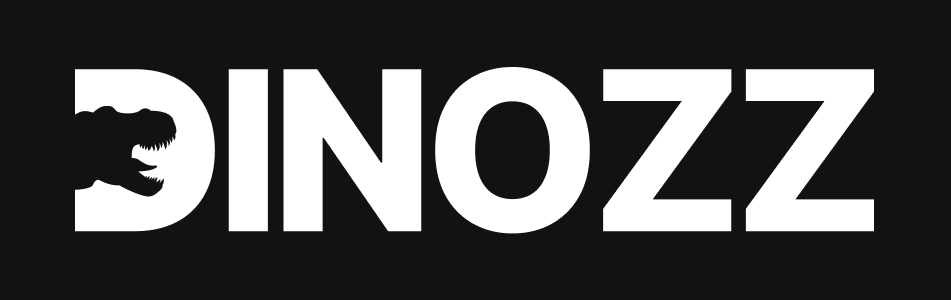

    
  

    <a href="https://dinozz-discovery.onrender.com/">View App</a>
    &nbsp;·&nbsp;
    <a href="https://github.com/chingu-voyages/voyage-project-tier2-dinosaurs/issues">Report Bug</a>
    &nbsp;·&nbsp;
    <a href="https://github.com/chingu-voyages/voyage-project-tier2-dinosaurs/issues">Request Feature</a>
  

## Preview
  
  

## Table of Contents
- [Project Description](#project-description)
- [Built With](#built-with)
- [Tools Used](#tools-used)
- [Features](#features)
- [Getting Started](#getting-started)
- [Our Team](#our-team)
- [Design](#design)
- [Acknowledgements](#acknowledgements)

## Project Description
DINOZz is a web application that helps dinosaur enthusiasts explore and learn about various types of dinosaurs quickly and easily. The data, sourced from the National History Museum in London, includes details about each dinosaur’s characteristics, diet and geographical origin. Users can search and filter the dinosaurs, save their favorites, dive into interactive charts for insights, check the locations map where they have been found and stay updated with the latest news in this field.

## Built With

 &nbsp;&nbsp; &nbsp;&nbsp; &nbsp;&nbsp; &nbsp;&nbsp; &nbsp;&nbsp;

## Tools Used

  
 &nbsp;&nbsp; &nbsp;&nbsp; &nbsp;&nbsp; &nbsp;&nbsp; &nbsp;&nbsp; &nbsp;&nbsp;

## Features
- **Search component:** Allows users to search for dinosaurs by name, weight, length, country, and diet. While searching by name, users get autocomplete suggestions matching the names of the dinosaurs.
- **Dinosaur display card:** After the users perform the search, the results show a card for each dinosaur, displaying its name, weight, length, country, diet and corresponding image.
- **Dinosaur details page:** Showcases dinosaur’s full details, description, location and corresponding image sourced from the provided API data.
- **Dinosaur location map:** Displays the location of a selected dinosaur on a map. After selecting a specific dinosaur and going to its details page, users can find a map with its geographic location.
- **General locations map:** Displays all the countries where dinosaurs have been found, while every country shows a list of its dinosaurs. The results are dynamically generated from the provided API data.
- **Charts section:** Displays two charts (pie chart and doughnut chart) illustrating the distribution of general dinosaur diet and type data.
- **News section**: Displays the latest news about dinosaurs
- **Favorites feature**: Users have the possibility to save a dinosaur to favorites and then view it in a separate Favorites page

## Getting Started
Open our app on [Render](https://dinozz-discovery.onrender.com/)  
OR  
You can clone the repository to your local machine.

## Our Team
### Developers:
- Andra Mertilos #1: [GitHub](https://github.com/andram11) / [LinkedIn](https://www.linkedin.com/in/andra-mertilos-49008055/)
- Stefan Brkic #2: [GitHub](https://github.com/stefanbrkic1) / [LinkedIn](https://www.linkedin.com/in/stefan-brki%C4%87-4014012a3/)
- Andrei Olteanu #3: [GitHub](https://github.com/andreiolteanu555) / [LinkedIn](https://www.linkedin.com/in/andrei-olteanu-9009/)
### Product Owner: 
- Osayande Osarumen: [GitHub](https://github.com/Chukuli12) / [LinkedIn](https://www.linkedin.com/in/osarumen-osayande-019a3823b)

## Design
The Figma design for this project can be found [here](https://www.figma.com/file/MZxzw4y2hb6JcXN1fSPcPp/DinozzApp?type=design&node-id=0-1&mode=design&t=ycU9vLm4zFagHVm7-0).

## Acknowledgements
- The [National History Museum](https://www.nhm.ac.uk/) in London provided access to the dataset containing dinosaur information.
- We used [GNews](https://gnews.io/) for getting the latest news about dinosaurs.